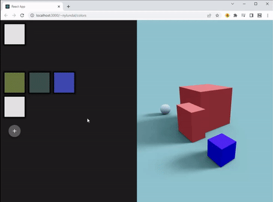

# Colour-swatches
A proof of concept for a tool to test colour combinations in an intuitive way. 

The end goal would further support changing the colours and textures in the 3D environment seen on the right side in the demo gif to see how the colours behave in different lighting conditions and on different materials. 

